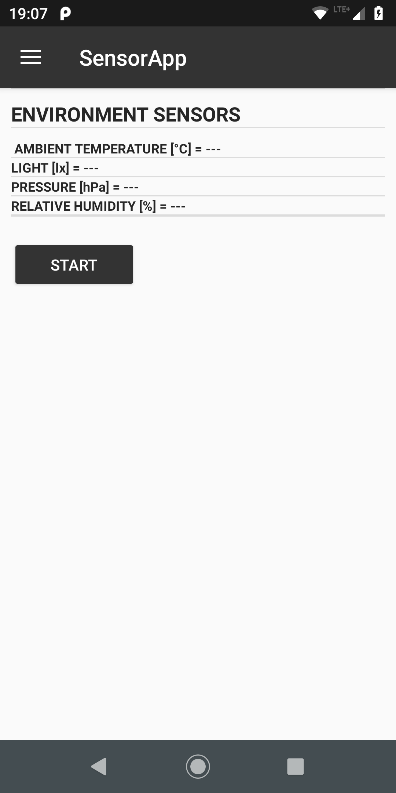
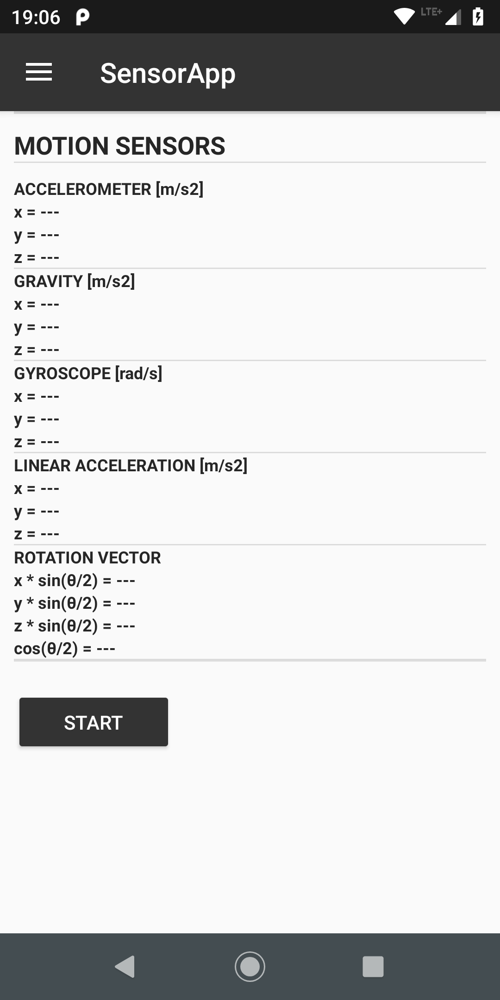
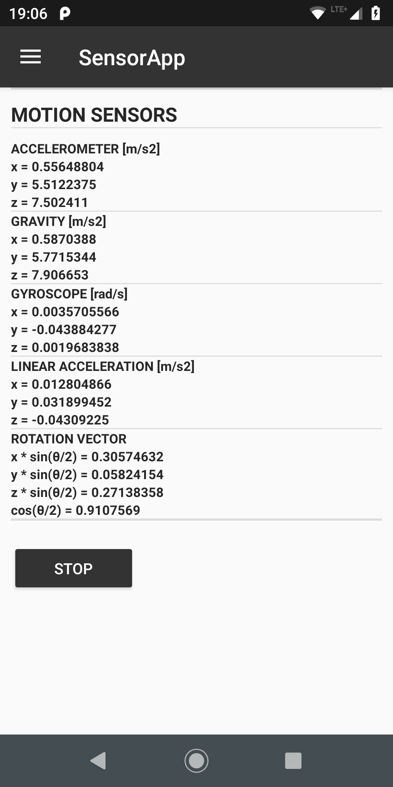
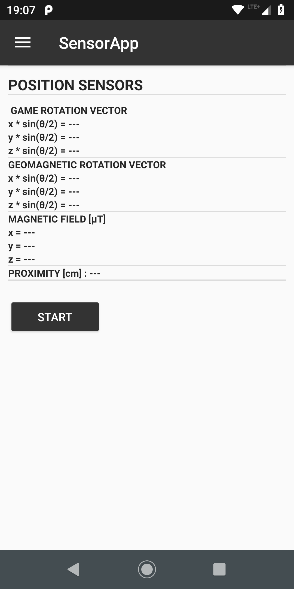
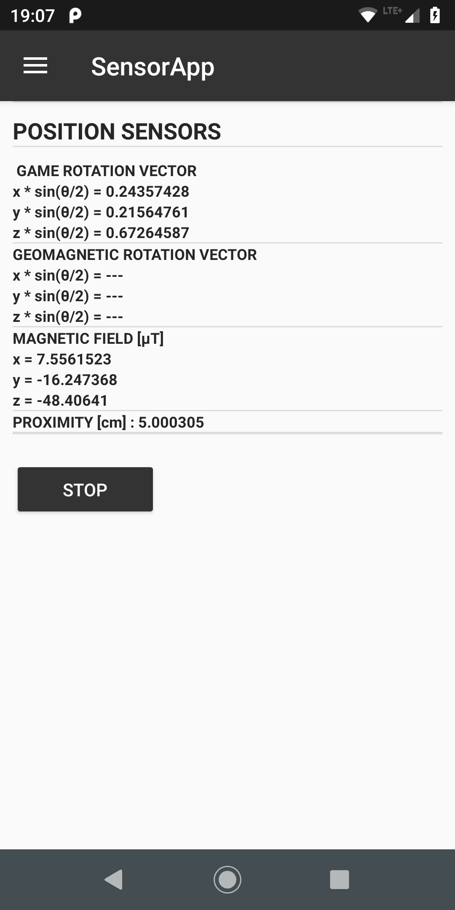
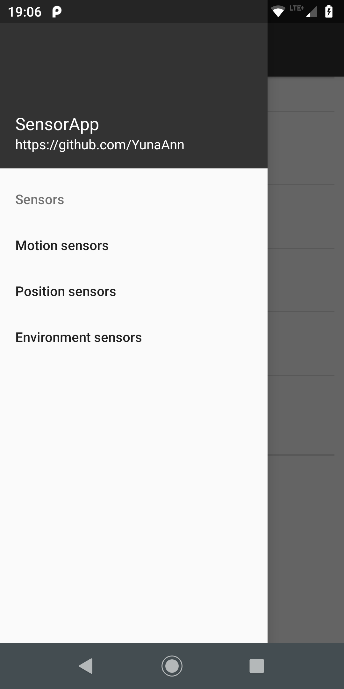

# SensorApp

SensorApp

Acquiring raw sensor data of following sensors:

Motion sensors:
    - accelerometer
    - gravity
    - gyroscope
    - linear acceleration
    - rotation vector

Position sensors:
    - game rotation vector
    - geomagnetic rotation vector
    - magnetic field
    - proximity

Environment sensors:
    - ambient temperature
    - light
    - pressure
    - relative humidity
	
Application tested on Motorola Moto G6 Plus.

	
	
	
	

	

